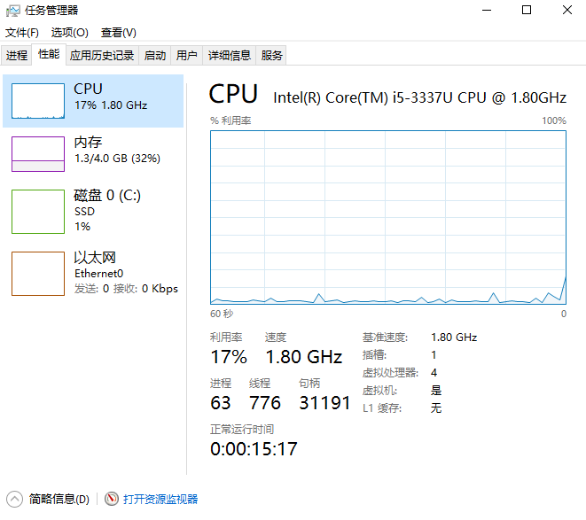
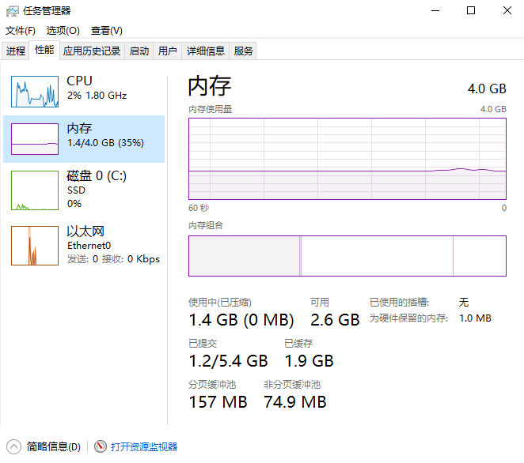
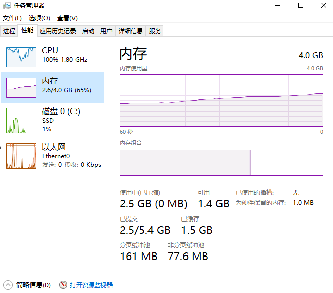
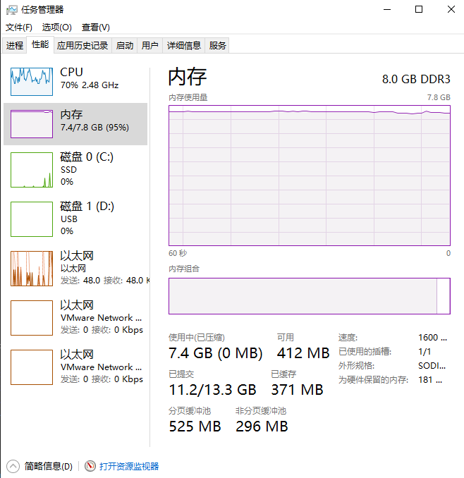
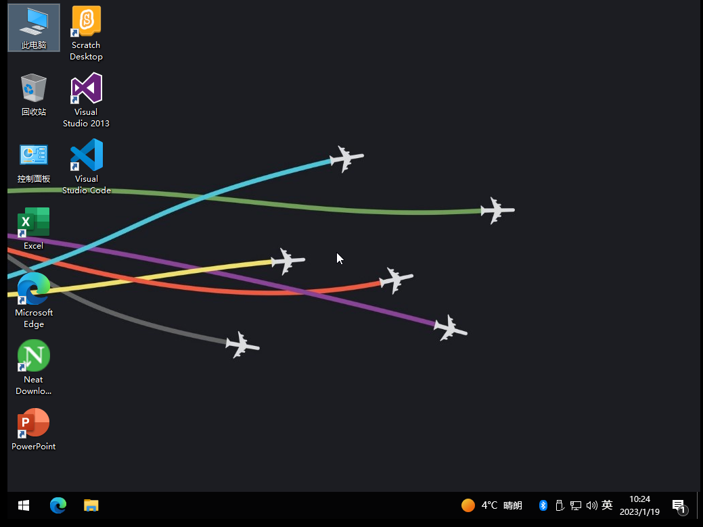
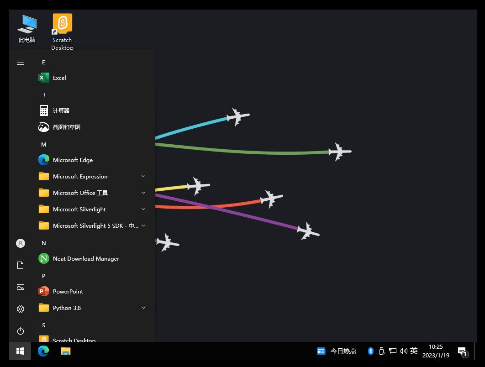

# WiCoding 是什么？
WiCoding 是Windows 10的二次封装系统，内置了C\C++，Python，Scratch开发环境。
# 一些基本信息
## 系统
WiCoding **精简**了Windows 10 22H2并以此作为基础新增了许多开发软件，搭建了开发环境。
（精简的和[不忘初心](https://www.pc521.net)差不多吧，，，）

系统版本：*Windows 10 22H2 19045.2364 x64* 可以运行大多数的软件

系统为了可以更新，安装了edge，后台升级会占一些内存

## 软件
因为内置开发软件较多，系统镜像较大，约 9 GB
### 有什么软件？

开发软件列表如下：
 - Neat Download Manager version 1.4 （用于下载文件）
 - Python Launcher （用于开发Python）
 - Scratch Desktop 3.6.0	（用于开发Scratch）
 - Microsoft Edge   （网页访问）
 - Microsoft Visual Studio Code （Python C++ 编辑器）
 - Microsoft Visual Studio Professional 2013 （C++ IDE）

### 完整软件列表见文末
总之 总计 **48 个程序**占用空间 **>12.2 GB**

主要的占用就是 Microsoft Visual Studio Professional 2013

现在您知道为什么这个系统的安装镜像较大了吗？

## 性能

基于精简版系统，所以性能还行。

开机CPU进程大约在60多

内存占用也比较少

不开软件系统仅占1.2-1.6GB

开软件占用也不高

>就是我实体机。。。。要废了

## 图图！

刚安装好系统的样子，个人审美勿喷

开始菜单做了简化

# 我该如何下载它？

在线网盘正在上传，稍后会更新链接
**此作品是提供给系统爱好者研究交流使用，不可用于商业目的，否则后果自负！版权归原作者所有,请在下载后于24小时内删除！引起的一切法律责任与本人无关！**
---

完整软件列表：
| 软件名 | 占用 |
| :-----:| :----: |
|Neat Download Manager version 1.4|	2.31 MB|
|Python Launcher|	1.77 MB|
|Scratch Desktop 3.6.0|	314 MB|
|Microsoft Edge|	137 MB|
|Microsoft Edge Update|	273 MB|
|Microsoft Visual Studio Code| >1.00 GB|
|Microsoft Visual Studio Professional 2013|	7.00 GB|
|以下为Microsoft Visual Studio Professional 2013的组件|注释|
|IIS 8.0 Express|	36.0 MB|
|IIS Express Application Compatibility Database for x64|	17.4 MB|
|IIS Express Application Compatibility Database for x86|	17.4 MB|
|Microsoft .NET Framework 4 Multi-Targeting Pack|	83.4 MB|
|Microsoft .NET Framework 4.5 Multi-Targeting Pack|	41.8 MB|
|Microsoft .NET Framework 4.5 SDK|	18.5 MB|
|Microsoft .NET Framework 4.5 SDK - 简体中文 语言包|	3.36 MB|
|Microsoft .NET Framework 4.5.1 Multi-Targeting Pack|	49.3 MB|
|Microsoft .NET Framework 4.5.1 SDK|	19.4 MB|
|Microsoft .NET Framework 4.5.1 SDK（简体中文）|	3.33 MB|
|Microsoft .NET Framework 4.5.1 多目标包(简体中文)|	70.9 MB|
|Microsoft Help Viewer 2.1|	12.9 MB|
|Microsoft Help Viewer 2.1 语言包 - CHS|	12.9 MB|
|Microsoft Office LTSC 专业增强版 2021 - zh-cn|	2.53 GB|
|Microsoft Silverlight|	53.3 MB|
|Microsoft Silverlight 5 SDK - CHS|	76.3 MB|
|Microsoft SQL Server 2012 Data-Tier App Framework (x64)|	11.7 MB|
|Microsoft SQL Server 2012 Express LocalDB|	161 MB|
|Microsoft SQL Server 2012 Native Client|	8.91 MB|
|Microsoft SQL Server 2012 Transact-SQL ScriptDom|	4.59 MB|
|Microsoft SQL Server 2012 T-SQL Language Service|	6.19 MB|
|Microsoft SQL Server 2012 管理对象|	26.9 MB|
|Microsoft SQL Server 2012 管理对象(x64)|	17.0 MB|
|Microsoft SQL Server 2012 命令行实用工具|	1.06 MB|
|Microsoft SQL Server 2012 数据层应用程序框架|	11.7 MB|
|Microsoft SQL Server Compact 4.0 SP1 x64 简体中文版|	9.33 MB|
|Microsoft SQL Server Data Tools - CHS (12.0.30919.1)|	19.1 MB|
|Microsoft SQL Server Data Tools Build Utilities - CHS (12.0.30919.1)|	2.55 MB|
|Microsoft SQL Server System CLR Types|	2.55 MB|
|Microsoft SQL Server System CLR Types (x64)|	3.13 MB|
|Microsoft System CLR Types for SQL Server 2012|	2.83 MB|
|Microsoft System CLR Types for SQL Server 2012 (x64)|	1.52 MB|
|Microsoft Visual C++ 2012 Redistributable (x64) - 11.0.60610|	20.5 MB|
|Microsoft Visual C++ 2012 Redistributable (x86) - 11.0.60610|	17.3 MB|
|Microsoft Visual C++ 2015-2019 Redistributable (x64) - 14.24.28127|	23.1 MB|
|Microsoft Visual C++ 2015-2019 Redistributable (x86) - 14.24.28127|	20.1 MB|
|Microsoft Visual Studio 2010 Tools for Office Runtime (x64)	6.16 MB||
|Microsoft Visual Studio 2010 Tools for Office Runtime (x64)语言包 - 简体中文|	6.16 MB|
|Microsoft Web Deploy 3.5|	11.8 MB|
|SSDT 必备组件|	8.11 MB|
|WCF RIA Services V1.0 SP2|	9.60 MB|
|Entity Framework Tools for Visual Studio 2013|	140 MB|
|总计 **48 个程序** |**>12.2 GB**|

